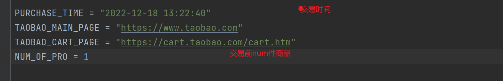

# AutoGrab
自动下单抢购python脚本
参考的repo是https://github.com/veezean/AutoBuyScripts/blob/master/fastbuy_taobao.py
时间有限，目前只支持自动下单已经存在于购物车里面最前方的若干个商品
## 如何使用
1. 首先安装git，clone此仓库
2. 安装python
3. 在cmd里面执行 `pip install -r requirements.txt`安装相关包
4. 修改程序中一些变量
   1. 
5. 安装对应的chrome版本的驱动到移动到项目的根目录，并将文件名改成 `chromedriver_windows.exe`
* 目前支持windows电脑
* [驱动安装地址](http://chromedriver.storage.googleapis.com/index.html)
6. 运行即可
